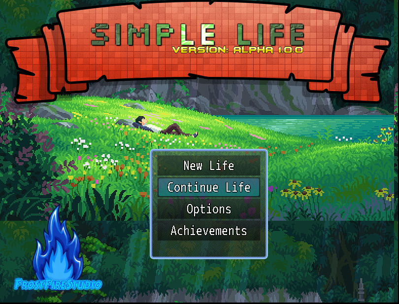

# SimpleLife - Farming Sim 
Top down RPG Farming / Town game!

Welcome to a whole new world of relaxing and farming! Simple Life is a Top down style farming / RPG game, with many ideas in play and being created we hope to be able to share some insight on the game progess soon! 

# CURRENT PROGRESS - Alpha 1.0.0
🗾 Map Design - 

🎭 Triggers & Events -

⚙️ Game mechanics - 

👾 Custom Desgins - 

# In Game screenshots [ALPHA 1]

## Roadmap

Alpha 1.0.0 - CURRENT VERSION
- [x] Different Areas | 11+
- [x] Custom Menus | Needs Work
- [x] Mini-Map | Currently Dissabled
- [ ] Changelog | In Game
- [x] Fishing | Building from scratch
- [ ] Farming | Building from scratch
- [ ] New sound effects | TBD
- [ ] New UI | Under Work
- [x] Trophy system | More next update
- [x] NPC's | 6+
- [x] Home | Customization In Later Update
- [x] Inn | Place to Sleep & Heal
- [x] Shops | 3+
- [x] Items | More Next Update
- [x] Misc Items | More Next Update
- [x] Consumables | More Next Update
- [x] Skills | Fishing / Hunting / Farming
- [x] Weapons | Sword / Dagger / Battleaxe / Bow
- [ ] Crafting | Building from Scratch
- [x] Currency Setup | Gold

Alpha 2
- [ ] Update Fishing
- [ ] Rework Farming system
- [ ] Custom Players
- [ ] Custom Items
- [ ] Custom Wildlife
- [ ] Multi-language Support
- [ ] Complete Rework Of TileSets
- [ ] Expand Fishing
- [ ] Expand Farming
- [ ] Expand Story line
- [ ] Add Rewards
- [ ] Expanded Custom Menus
      
Roadmaps are our way of showing our goals for each version of a game release. Roadmaps will be chaged and updated constantly! 

<h1 align="center">Hi 👋,Welcome to FrostFireStudio</h1>

<h3 align="center">A Indi-Game Development Company</h3>

  

- 🔭 We are currently working on [Simple Life](TBD)

- 🌱 We are currently learning **Game Development/ Scripting**

- 🤝 We are looking for help with [FrostFireStudio’s Dev Team](https://discord.gg/hEj5PQJ8P2)

- 👨‍💻 All of our projects are available at [COMMING SOON](COMMING SOON)

- 📫 How to reach me **FrostFireStudio@outlook.com**

<h3 align="left">Connect with me:</h3>

<h3 align="left">Languages and Tools:</h3>

        

